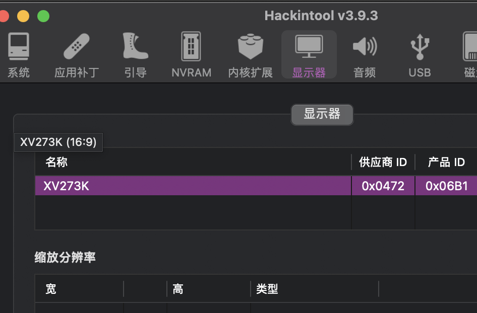
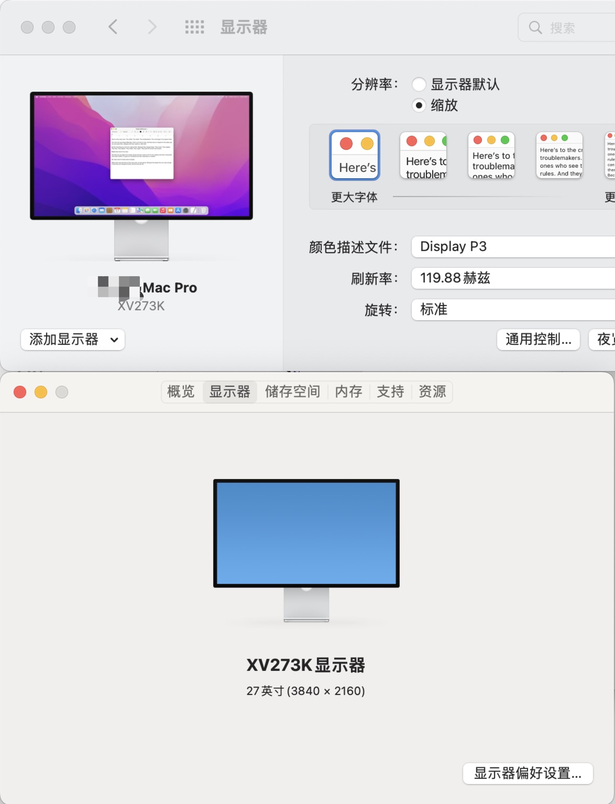

+++
title = 'How to Customize Display Icon on macOS'
date = 2024-04-24T22:12:42+08:00
categories = ["macOS", "Hackintosh"]
draft = false
ShowToc = true
TocOpen = true
+++

> When connecting a third-party monitor to macOS, the monitor icon in the "About This Mac" and "System Preferences" displays page hasn't been updated for at least five major versions, and looks very old. Recently, I successfully replaced the icon with Studio Display's icon through research and personal trial. This is a record of the specific method of customization.
> 

## 1. Determine the Monitor's ID

In macOS, for settings related to the monitor, you first need to confirm the two IDs of the monitor: Vendor ID and Product ID. Since I'm using a Hackintosh, I use Hackintool to obtain this information:



> Note: Use hexadecimal letters in lowercase and remove the leading 0.
> 

## 2. Create Folder and Icon File

Go to the path `/Library/Displays/Contents/Resources/Overrides` (if the corresponding directory does not exist, create it). Then:

1. Create a folder named `DisplayVendorID-{Vendor ID}`
2. Move the two icon files to the created folder and name them `DisplayProductID-{Product ID}.icns` and `DisplayProductID-{Product ID}.tiff` respectively. The former is the icon in "About This Mac", and the latter is the icon in "System Preferences".

Then, just in case, set the permissions of these new directories and files:

```bash
cd /Library/Displays/Contents/Resources/Overrides
sudo chown -R root:wheel .
sudo chmod -R 0755 .
sudo chmod 0644 DisplayVendorID-{Vendor ID}/*

```

After completing these steps, modify `Icons.plist` to add the corresponding configuration.

## 3. Configure `Icons.plist`

The monitor's icon information is managed by the configuration file `Icons.plist`. According to the previous steps:

1. If the path `/Library/Displays/Contents/Resources/Overrides` does not exist, you can find the system's own file in the path `/System/Library/Displays/Contents/Resources/Overrides`. Generally, choose to copy it to the former for modification, because the latter path is read-only. This situation usually occurs in newer systems after macOS 12;
2. If the above path exists, just make a backup and modify the original file. This usually occurs on older systems.

Taking my customization as an example, add the following content at the end of `Icons.plist`:

```xml
... other content
        <key>472</key>
        <dict>
        <key>products</key>
            <dict>
                <key>6b1</key>
                <dict>
                    <key>display-resolution-preview-icon</key>
                    <string>/Library/Displays/Contents/Resources/Overrides/DisplayVendorID-472/DisplayProductID-6b1.tiff</string>
                    <key>resolution-preview-x</key>
                    <integer>12</integer>
                    <key>resolution-preview-y</key>
                    <integer>71</integer>
                    <key>resolution-preview-width</key>
                    <integer>202</integer>
                    <key>resolution-preview-height</key>
                    <integer>113</integer>
                    <key>display-icon</key>
                    <string>/Library/Displays/Contents/Resources/Overrides/DisplayVendorID-472/DisplayProductID-6b1.icns</string>
                </dict>
            </dict>
        </dict>
        <key>display-icon</key>
        <string>public.display</string>
    </dict>
</dict>
</plist>

```

The above content is straightforward. It uses the two IDs of the monitor as the key, and then adds:

- Two icon paths
- Preview icon's position coordinates and width and height

As values.

Finally, restart the system, and if all goes well, the icon will have been successfully replaced after the restart. Here's a successful screenshot:




Reference:

[GitHub - xzhih/one-key-hidpi](https://github.com/xzhih/one-key-hidpi/tree/master)